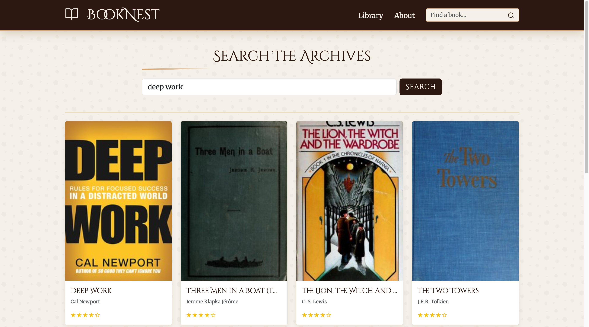
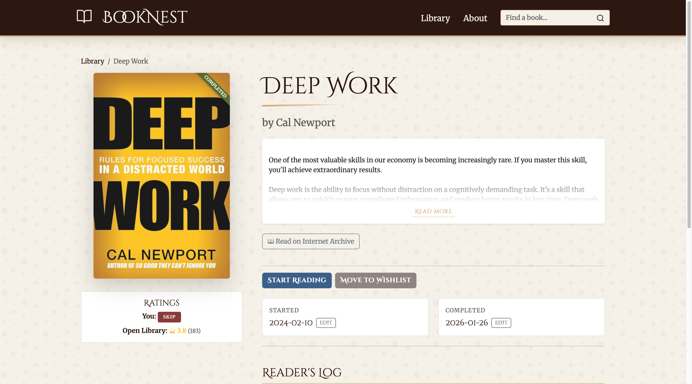

<p align="center">
  
</p>

<h1 align="center">BookNest</h1>

<p align="center">
  A digital sanctuary for the modern reader.<br/>
  A vintage-styled personal library app built for mindful reading.
</p>

<p align="center">
  
  
  
  
  
  
</p>

---

## Overview

BookNest is a **single-user full-stack library management application** that helps you catalog books, track reading progress, and maintain a personal reading journal.  
The experience is intentionally distraction-free, inspired by the quiet, tactile feel of a physical bookshelf.

The project emphasizes **clear domain rules**, **backend-first correctness**, and a calm, purposeful user experience rather than social or feed-driven interactions.

---

## Features

### Library Management
- Maintain a personal library with four explicit states:
  - Wishlist
  - Reading
  - Completed
  - Dropped
- Each book always has exactly one active status.
- Once a book is completed, it cannot be dropped again (enforced at controller level).

### Reading Progress Tracking
- Optional **Started Date**, prompted only the first time a book enters the Reading state.
- Optional **Completed Date**, prompted only the first time a book is completed.
- Date validation ensures logical consistency when both dates exist.

### Ratings & Reviews
- Tag-based rating system (no numeric scores):
  - Perfection
  - Go for it
  - Time pass
  - Skip
- Rating is mandatory only when marking a book as completed.
- Books can have multiple journal-style reviews.
- Each review records the reading status at the time it was written.
- Reviews can be edited for minor corrections while preserving timeline integrity.

### Open Library Integration
- Search books using the Open Library Search API.
- Fetch external metadata such as:
  - Covers
  - Descriptions
  - Public ratings
  - Internet Archive preview links (when available)
- External data is **never persisted** and is used only for UI enrichment.

### Seamless Discovery Flow
- Books discovered via Open Library open in the same detail view as tracked books.
- If a discovered book already exists in the library, the app redirects automatically.
- Adding a discovered book respects all existing business rules and state transitions.

---

## Vintage UI & UX

BookNest is designed to feel like a quiet, personal reading space rather than a modern feed-based app.

The interface uses a handcrafted design system built around:
- **Royal gold accents**
- **Sepia parchment tones**
- Subtle textures inspired by physical books and journals

The application uses **server-side rendering (SSR)** with **EJS**, keeping the experience fast, predictable, and simple.

Interaction details are intentionally understated:
- Vintage-style headings and typography
- Brush-stroke visual accents
- Gentle floating interactions
- Expandable book descriptions implemented using vanilla JavaScript

The goal is not visual spectacle, but a calm, tactile experience that complements long-form reading and reflection.

---

## Screenshots






---

## Tech Stack

**Backend**
- Node.js
- Express.js
- PostgreSQL
- pg

**Frontend**
- EJS (Server-Side Rendering)
- Bootstrap 5
- Vanilla JavaScript
- Custom CSS

**External APIs**
- Open Library Search API
- Open Library Covers API
- Open Library Ratings API
- Internet Archive preview links (via Open Library)

---

## Project Architecture

```

├── controllers/        # Business rules and request handling
├── services/           # External API integrations
├── routes/             # Express route definitions
├── db/                 # PostgreSQL connection
├── sql/                # Schema and seed files
├── utils/              # Shared utilities (date validation)
├── views/              # EJS templates (pages and partials)
├── public/             # Static assets (CSS, JS, images)
└── index.js            # Application entry point

````

Key architectural principles:
- Controllers are the single source of business rules.
- Services encapsulate all external API communication.
- Views never enforce logic or state transitions.
- The database is the authoritative source of user-owned data.

---

## Database Design

- **books**
  - Stores user-owned data and canonical identifiers.
  - Uses Open Library Work OLID as the primary external reference.
- **reviews**
  - One-to-many relationship with books.
  - Each review captures historical reading context.

The schema is intentionally minimal to keep the domain model explicit and maintainable.

---

## Getting Started

### Prerequisites
- Node.js (v18 or later recommended)
- PostgreSQL

### Installation

```bash
git clone https://github.com/Ash-the-k/BookNest.git
cd booknest
npm install
````

### Database Setup

1. Create a PostgreSQL database.
2. Run the schema:

   ```bash
   psql -d booknest -f sql/schema.sql
   ```
3. (Optional) Seed sample data:

   ```bash
   psql -d booknest -f sql/seed.sql
   ```

### Environment Variables

Create a `.env` file in the root directory:

```env
DB_HOST=localhost
DB_USER=your_user
DB_PASSWORD=your_password
DB_NAME=booknest
DB_PORT=5432
```

### Running the Application

```bash
node index.js
```

Open your browser at:

```
http://localhost:3000
```

---

## Scope & Limitations

This project is intentionally **single-user**.

Out of scope by design:

* Authentication or user accounts
* Social or sharing features
* Recommendations or analytics
* Mobile application support

These decisions were made to preserve clarity of domain logic and UX focus.

---

## Acknowledgements

- Book metadata, covers, and public ratings provided by  
  [Open Library](https://openlibrary.org/developers/api)

- Preview access and archival links powered by  
  [Internet Archive](https://archive.org/)

---

## About the Project

BookNest was built by **Ashlesh** as a capstone project for [The Complete Web Development Bootcamp](https://www.udemy.com/course/the-complete-web-development-bootcamp/) by Dr. Angela Yu.

The goal of the project was to design a database-driven reading tracker with clear domain rules, safe API integration, and a calm, user-focused interface.

---

## License

This project is licensed under the **MIT License**.  
See the [LICENSE](LICENSE) file for details.


